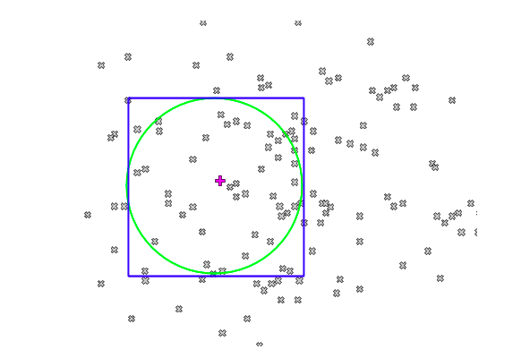

# realestate-matcher
A Golang application which implements a basic property listing to requirement matching algorithm

## Problem

Match property listings with requirement requests efficiently.
1. All matches above 40% can only be considered useful.
2. The code should scale up to a million properties and requirements in the system.
3. All corner cases should be considered and assumptions should be mentioned
4. Requirements can be without a min or a max for the budget, bedroom and a bathroom but either min or max would be surely present.
5. For a property and requirement to be considered a valid match, distance should be within 10 miles, the budget is +/- 25%, bedroom and bathroom should be +/- 2.
6. If the distance is within 2 miles, distance contribution for the match percentage is fully 30%
7. If budget is within min and max budget, budget contribution for the match percentage is full 30%. If min or max is not given, +/- 10% budget is a full 30% match.
8. If bedroom and bathroom fall between min and max, each will contribute full 20%. If min or max is not given, match percentage varies according to the value.
9. The algorithm should be reasonably fast and should be quick in responding with matches for the users once they upload their property or requirement.

## Choice of Language and Reasoning

There are few aspects of the algorithm which need some concurrent tasks which were mostly computational tasks which led me to code the program in Golang.

I could have actually used python too but Golang seemed to be a better fit in this case. Choosing a language should always be a design and requirement decision. Language is what I believe is just a tool. Main focus should be on the usecases and requirement and let that define what would be the best choice.

In this case, given concurrent computational task, Golang having goroutines and better in terms of computation tasks. Python having GIL would not be an idle choice, although you can still use multiprocessing to perform tasks in parallel. But given Golang and python, golang seemed to be a better fit here.

## Usecases

1. Match a user requirement to available property listings in database.
2. Match a property listing to already available requirements in database.

## Approach

1. **When a property is listed:**

    The application should provide a list of matching requirements based on the criteria
    At the same time, add this new property listing to database to let later requirements see this listing

1. **When a requirement is given by the user:**
    
     The application should provide a list of matching property listings based on the criteria
     At the same time, add this new requirement to database to let later property listings see this requirement

## Assumptions

The DB will contain two tables:
1. **properties -** consists of property listings with those 6 attributes with an additional created/added on date attribute too.
2. **requirements -** consists of user requirements with those 9 attributes with an additional created/added on date attribute too.

## CODE Structure

The problem statement only needed the  algorithm, so I haven’t added any API to use the algorithm.
I have tried to keep the code following Clean Architecture to make it as much Extensible as possible. Maintainability is alway important as we read code more than we write code.

The code is structured around the two Usecase discused above:
* Requirement processing to match available properties to it.
* Property Processing to match available requirements 

I feel code structure modeled around usecases always feels more humanly and easily understandable.

There are mainly 7 files.
1. **domain.go** - contains the domain of the application, namely the Property and Requirement domain descriptions and some data validation methods
2. **db.go** - initializes db connection, no other logic, nothing of significant importance here.
3. **requirement_processing.go** - contains the requirement processing usecase logic. This basically handles the First Step for filterting the good candidates as mentioned in the TL;DR section.
4. **property_processing.go** - exactly same as requirement_processing.go which performs the First Step filtering, only this time it is for the property addition usecase.
5. **requirement_match_algo.go** - Contains the algorithing wchich takes the requirement and candidates from the First step and returns the match based result.
6. **property_match_algo.go** - Same as requirement_match_algo.go but only it matches property with the filtered requirements gathered from the First step.
7. **main.go** - The customary golang main file which does nothing except has a basic func to show how all those usecase processor can be created by some neat dependency injections to keep the code extensible. Meaning you can write and differenet version of the algorithm, different version of db client and yet the main business logic will not be touched much to satisfy Open/Close principle of SOLID design, whcih leads to maintable code. In a real world scenario, one would start a api server and define routes and connect them to controllers in this file. Not done in this case.

**NOTE :** I have used goroutines to run the matching algorithms tasks concurrently.
**NOTE :** I have also provide decent comments and documentation in the code itself, so that you can get a better idea of the code structure while reading it.

## TL;DR version:

The working is very simple actually. I may have explained things in detail so may be the document may seem long, but let me just show you its mainly just a two step process. 

1. **First Step** 	- Filter some candidates based on initial criteria.
2. **Second Step** 	- Run algorithm on those filtered out set.

Assume all the grey cross signs representing all the properties or requirements present in the database. Now, the pink plus sign represent a requirement or a property listing (basically a latitude and longitude coordinate of the requirement).

**First Step** mentioned above will filter out bad candidates and get a Blue Bounding box and with some more addition upto the Green Circle of good candidates.

**Second Step** mentioned above will run the actual matching algorithm on that set and return the result.

*Check below for detailed version.*
I have explained each step in a very detailed way including the formulae being used in the code. It’s much like a tech doc. But you can skip most of it if you don’t feel like reading each bit.

## Usecase 1 -  New Requirement Added:

To match a set of property listings to this new requirement, there are few things to be done:

### Step 0 - Add to database:

Add the new requirement to the requirements table in the agentdesks database. This will ensure data safety in case of server failure when the matching algorithm is run.

### Step 1 - Base Filtering:

First filter out a set of the property listings from the properties table to reduce the search space from millions of properties to a handful few. Reason being that all of them cannot be candidates for the requirement matching algorithm. We will do filtering based on distance, budget, bedrooms and bathrooms.

1. **Distance filtering:**
   
    This may be a little complex one, rest of them are comparatively much easier.

    Since the earth is not a 2d planar object, we need a Great Circle Distance. formula. 
    Here, I am using the spherical law of cosines  formula to calculate distance as  follows:

        D = acos( sin(lat_1)*sin(lat_2)
        + cos(lat_1)*cos(lat_2)*cos(lon_2 - lon_1) ) * R

    Where,  
    
        lat_1 & lat_2   =  latitude in radians,
	    lon_1 & lon_2 	=  longitude in radians,
	    R 	        =  radius of earth in miles
        D 	        =  distance in miles
  

    #### Method:

    We can make a bounding box which is depicted by the blue square in the above figure.
    We can get those bounding latitude and longitude by the below mentioned formula:

        Lat_top 	= 	lat_given + (d/R)
        Lat_bottom      = 	lat_given - (d/R)
        Lon_left 	= 	lon_given - (d/R)/cos(lat_given)
        Lon_right 	= 	lon_given + (d/R)/cos(lat_given)

    But, its good to note that as the bounding box becomes larger, there are some inaccuracy that comes in, to overcome that, we can change the longitude boundaries calculation to this:
        
        Lon_left 	= 	lon_given - asin(d/R)/cos(lat_given)
        Lon_right 	= 	lon_given + asin(d/R)/cos(lat_given)

    Where,  
        
        R   = 	radius of earth in miles,
        d   =   distance in miles within which all the property listings should be in, eg: 10 miles.

    #### SQL Query:

        SELECT latitude, longitude, acos( sin(latitude)
        *sin(lat_given)  +  cos(latitude)*cos(lat_given)
        *cos(lon_given - longitude) ) * R 
        as distance
        From properties
        Where latitude Between lat_top And lat_bottom
        And longitude Between lon_left And lon_right
        And distance <= 10;

    By also using the spherical law of cosine formula to limit the distance within 10 miles in the above sql query we get the Green Circle from among the Blue Bounding Box show in the above diagram.

    #### Advantage:
    
    We can now use an index on latitude, longitude pair to make the sql query even faster.

    **NOTE :** Just to not lose track of things, the initial base filtering, we not only have to filter things based on distance which is what the above method achieves, we also have to do filtering based on 3 more parameters, let’s look at them too.

2. **Budget filtering:**

    The requirement consists of a min and max budget or sometimes just either of them. We need to consider only those property listings which are within +-25% of the requirement budget.

    * **Case 1:** *both min and max budget given:*

        Then range of price attribute in the properties table that should be matched can be calculated by:

            minPrice = Max( (minBudget - (25% of minBudget), 1.0)
                            // max() makes sure we don’t consider any negative prices
            maxPrice = Max((maxBudget + (25% of maxBudget)), 1.25)

    * **Case 2:** *only min budget given or only max*:

            // budget given: When only min Budget given,
            minPrice = max((minBudget - (25% of minBudget)), 1.0)
            maxPrice = max( (minBudget + (25% of minBudget)), 1.25)

            // When only max Budget given
            minPrice = 0 (This is because when max budget is specified, it 
                        means we only are strict about the maximum budget, any lower price would still suffice the max budget requirement - But this may give results of lower quality properties as opposed to the expectation of the user requirement, hence we can use the below value instead)
                     OR, max( (maxBudget + (25% of maxBudget)), 1.0)
            maxPrice = max( (maxBudget + (25% of maxBudget)), 1.25)

3. **Bedrooms filter:**

    The requirement consists of a min and max bedrooms or sometimes just either of them. We need to consider only those property listings which are within +-2 of the requirement bedrooms.

    * **Case 1:** *both min and max bedrooms given:*
    
       Then range of bedrooms attribute in the properties table that should be matched can be calculated by

            minBedrooms	= max((minBedroomsRequired - 2), 1)  
                            // max() function makes sure the no of bedrooms 
                                is at least 1 in quantity.
            maxBedrooms	= max((maxBedroomsRequired + 2), 1)

    * **Case 2:** *only min bedrooms given or only max bedrooms given:*
        
            // When only min Bedrooms given,
            minBedrooms	= max((minBedroomsRequired - 2), 1)
            maxBedrooms	= max((minBedroomsRequired + 2), 1)

            // When only max Bedrooms given,
            minBedrooms	= max((maxBedroomsRequired - 2), 1)
            maxBedrooms	= max((maxBedroomsRequired + 2), 1)

4. **Bathrooms filtering:**

    Exactly similar to the Bedrooms filtering. Refer above.

    #### Final Merged Query

    By merging the above 4 filterings, we come at the final SQL Query:

        SELECT latitude, longitude, acos( sin(latitude)*sin(lat_given)  +  
        cos(latitude)*cos(lat_given)*cos(lon_given - longitude) ) * R 
        as distance, price, bedrooms, bathrooms
        From properties
        Where latitude Between lat_top And lat_bottom
        And longitude Between lon_left And lon_right
        And distance <= 10
        And price Between minPrice And maxPrice
        And bedrooms Between minBedrooms And maxBedrooms
        And bathrooms Between minBathrooms And maxBathrooms;

### Indexing

For the above sql query, we can see that we can create some kind of index on few fields to speed up the query. 

We see almost all the fields are used in the where clause, it may feel like creating a multi attribute index including all the attributes here.
But that may increase insert time and take a lot of Ram memory.
For start, lets just create index of (latitude and longitude) pair and eventually do performance analysis by adding other attributes to the index and see if the performance improves or degrades and accordingly decide on it.
For now, just index on (latitude, longitude)

### Step 2 - Run Matching Algorithm

After selecting the filtered out subset of rows from the database using the above mentioned Merged Query, from Step 1, let’s say for an example we have got 100 property listings out of the millions of property listings available in the DB using the SQL query.

We now have to run an algorithm on these 100 property listings and return the best possible match of property listings for the asked requirement. Algorithm will return in decreasing sorted order of match score (only score of more than 40% should be considered useful)

#### ALGORITHM

There are 4 parameters for matching, each with certain percentage weightage given to it:
* Distance - radius (high weightage)  - 30% weightage
* Budget (high weightage)  - 30% weightage
* Number of bedrooms (low weightage)  - 20% weightage
* Number of bathrooms (Low weightage)  - 20% weightage

Lets take a scoring based approach. Lets say we will give scores to each property listing out of 100. A good candidate result is the one with a score of 40 and more

This mean we can start giving scores for each of the 4 parameters one by one. We can also see that each of the parameter are independent so we can actually give scores for each of those parameters concurrently. This means instead of doing a sequential scoring of the property listings for each of those parameters, we can run 4 parallel tasks to score each of parameter.

#### Task 1 - Distance Weightage Calculation (30 %):

All the property listings are already within 10 miles. Additionally, any distance within 2 miles get full 30 marks. We need to distribute the 30 marks in the range 2 - 10, where 2 means 100, 10 means 0.

    Marks for distance X  = 30, when X <= 2, OR,
                            ( (10 - X) /8 ) * 30 , when X > 2

#### Task 2 - Budget Weightage Calculation (30 %):

All the property listings prices are already within +-25% of the given budget requirement. So as to say the minPrice and maxPrice values calculated previously during Base Filtering Sql Query.

* **Case 1: When both min and max budget is given**

    Any price falling within the actual minBudget and maxBudget given in the requirement will get 30 marks.

    Prices which are either less the minBudget or greater than the maxBudget will need to be equally distributed and given marks accordingly.

    We need to distribute the 30 marks in the range  minPrice - minBudget, and maxBudget - maxPrice, where minBudget and maxBudget gets full 30 marks and minPrice and maxPrice get 0.

    * **For range minPrice - minBudget**

            Percentage for value x = ((x - minPrice) / (minBudget-minPrice)) * 100

    * **For range maxBudget - maxPrice**

            Percentage for value x = ((maxPrice - x) / (maxPrice-maxBudget)) * 100

    So finally:
            
        Marks for price X = 30, when minBudget <= X <= maxBudget
				            OR,
                            (Percentage for value X / 100 ) * 30, 
                            when X < minBudget or X > maxBudget

* **Case 2: When only min or max budget is given**

    Any price falling within the +-10% of minBudget or maxBudget given in the requirement will get 30 marks. Let’s call these boundary as min10Budget and max10Budget.

    Prices which are either less than min10Budget or greater than the max10Budget will need to be equally distributed and given marks accordingly.

    We need to distribute the 30 marks in the range  minPrice - min10Budget, and max10Budget - maxPrice, where min10Budget and max10Budget gets full 30 marks and minPrice and maxPrice get 0.

    The marks calculation is exactly similar to the above Case 1 except minBudget is replace by min10Budget and maxBudget is replaced by max10Budget. Refer case 1.

#### Task 3 - Bedrooms Weightage Calculation (20 %):

All the property listings bedrooms are already within +-2 of the given bedrooms requirement. So as to say the minBedrooms and maxBedrooms values calculated previously during Base Filtering Sql Query.

* **Case 1: When both min and max bedrooms is given**

    Any bedrooms falling within the actual minBedroomsRequired and maxBedroomsRequired given in the requirement will get 20 marks.

    Bedrooms which are either less the minBedroomsRequired or greater than the maxBedroomsRequired will need to be equally distributed and given marks accordingly.

    We need to distribute the 20 marks in the range  minBedrooms - minBedroomsRequired, and maxBedroomsRequired - maxBedrooms, where minBedroomsRequired and maxBedroomsRequired gets full 20 marks and minBedrooms-1 and maxBedrooms+1 get 0. 

    * **For range minBedrooms - minBedroomsRequired**

            Percentage for value x = ( (x - minBedrooms) / (minBedroomsRequired - minBedrooms) ) * 100

    * **For range maxBedroomsRequired - maxBedrooms**

            Percentage for value x = ( (maxBedrooms - x) / (maxBedrooms - maxBedroomsRequired) ) * 100

    Finally,

        Marks for bedrooms X = 20, when minBedroomsRequired <= X <= maxBedroomsRequired
			                    OR,
                               (Percentage for value X / 100 ) * 20, when X < minBedroomsRequired or X > maxBedroomsRequired

* **Case 2: When only min or max bedrooms is given**

    Any bedrooms equal to either  minBedroomsRequired or maxBedroomsRequired given in the requirement will get 20 marks.

    Prices which are either less than or greater than minBedroomsRequired or  maxBedroomsRequired  will need to be equally distributed and given marks accordingly.

    We need to distribute the 20 marks in the range  minBedrooms - minBedroomsRequired, and minBedroomsRequired - maxBedrooms when only minBedroomsRequired is given, and in the range  minBedrooms - maxBedroomsRequired, and maxBedroomsRequired - maxBedrooms when only maxBedroomsRequired is given, where minBedroomsRequired or maxBedroomsRequired gets full 20 marks and minBedrooms-1 and maxBedrooms+1 get 0. 

    The marks calculation is exactly similar to the above Case 1 except instead of using both minBedroomsRequired and maxBedroomsRequired, we will either use one of them as per given in the requirement to calculate the marks. Refer case 1.

#### Task 4 - Bathrooms Weightage Calculation (20 %)::

This is exactly similar to Task 3, so refer that for explanation.

**NOTE :** As mentioned above, we can perform each of those tasks one by one sequentially but since they are independent of each other, we can run all 4 tasks concurrently. This would reduce the time taken for the algorithm to complete.

### Step 3 - Sort Result Set:

After given scores for each section (each parameter), we will again filter out those listing having scores of more than 40. We will return the result set sorted by the matching score.

Property listings have same score would be further sorted based on distance, then by budget, then by no. of bedrooms, then by no. of bathrooms.

## Usecase 2 - New Property Listing Added:

 This is very very similar to the previous use case. The difference is this time is the filtering is done on the requirements table in the database with some small changes  in Base filtering SQL query. Rest all algorithm and its steps almost remains the same. I have mentioned the changes in the code comments properly.
